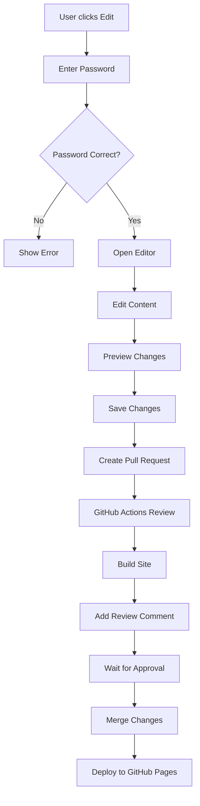

# 🚀 Live Editor System

A powerful live editing system for your Jekyll website, inspired by Android's documentation platform. This system allows authorized users to edit pages directly from the website and submit changes for review.

## ✨ Features

- **🔐 Password Protection** - Only users with the correct password can edit
- **📝 Live Editing** - Edit content directly in the browser
- **👀 Real-time Preview** - See changes as you type
- **🔗 GitHub Integration** - Changes are submitted as pull requests
- **🤖 Automated Review** - GitHub Actions automatically review changes
- **📱 Responsive Design** - Works on desktop and mobile
- **⌨️ Keyboard Shortcuts** - Ctrl+S to save, Esc to close

## 🎯 How It Works

1. **Edit Button** - A floating "Edit Page" button appears on all pages
2. **Password Authentication** - Enter the password (984904) to access the editor
3. **Live Editor** - Edit content in a full-screen modal with syntax highlighting
4. **Preview Mode** - Switch between content and preview tabs
5. **Save Changes** - Submit changes as a GitHub pull request
6. **Automated Review** - GitHub Actions automatically builds and reviews the site
7. **Manual Approval** - Review and merge the pull request

## 🔧 Installation

The live editor is already integrated into your Jekyll site. The following files have been added:

- `_plugins/live_editor.rb` - Jekyll plugin for live editor functionality
- `assets/live-editor.css` - Styling for the editor interface
- `assets/live-editor.js` - JavaScript functionality
- `.github/workflows/live-edit.yml` - GitHub Actions workflow

## 🎮 Usage

### For Editors

1. **Navigate** to any page on the website
2. **Click** the "Edit Page" button (bottom-right corner)
3. **Enter** the password: `984904`
4. **Edit** the content in the live editor
5. **Preview** your changes using the Preview tab
6. **Save** changes to create a pull request
7. **Wait** for review and approval

### For Administrators

1. **Monitor** pull requests in the GitHub repository
2. **Review** automated build results
3. **Test** changes locally if needed
4. **Approve** and merge pull requests
5. **Deploy** changes automatically via GitHub Pages

## 🔐 Security

- **Password Protection**: Only users with the correct password can access the editor
- **GitHub Integration**: All changes go through pull request review
- **No Direct Commits**: Changes cannot be made directly to the main branch
- **Audit Trail**: All changes are tracked in GitHub history

## 🛠️ Configuration

### Password
To change the password, edit the `authenticate()` method in `assets/live-editor.js`:

```javascript
const correctPassword = 'your-new-password';
```

### GitHub Repository
The system is configured for `upgautamvt/upgautamvt.github.io`. To change this, update the repository references in the JavaScript file.

### File Paths
The system automatically detects file paths based on the current page URL. For custom mapping, modify the `getCurrentPagePath()` method.

## 🎨 Customization

### Styling
Edit `assets/live-editor.css` to customize the appearance:

- Colors and themes
- Modal size and position
- Button styles
- Responsive breakpoints

### Functionality
Modify `assets/live-editor.js` to add features:

- Additional keyboard shortcuts
- Custom validation
- Enhanced preview functionality
- Integration with external services

## 🔄 Workflow



## 🚨 Troubleshooting

### Editor Not Loading
- Check browser console for JavaScript errors
- Ensure all assets are properly loaded
- Verify Jekyll is running correctly

### Password Not Working
- Double-check the password in the JavaScript file
- Clear browser cache and reload
- Check for typos in the password

### Changes Not Saving
- Verify GitHub repository permissions
- Check network connectivity
- Review browser console for API errors

### Build Failures
- Check GitHub Actions logs
- Verify Jekyll syntax in edited files
- Review pull request comments for errors

## 🔮 Future Enhancements

- **Real-time Collaboration** - Multiple users editing simultaneously
- **Version History** - Track all changes with diff view
- **Rich Text Editor** - WYSIWYG editing interface
- **Image Upload** - Drag and drop image support
- **Template System** - Pre-built content templates
- **Advanced Preview** - Live preview with full Jekyll rendering

## 📞 Support

For issues or questions about the live editor system:

1. Check the troubleshooting section above
2. Review GitHub Actions logs
3. Check browser console for errors
4. Create an issue in the repository

## 📄 License

This live editor system is part of your Jekyll website and follows the same license terms.

---

**Happy Editing! 🎉** 